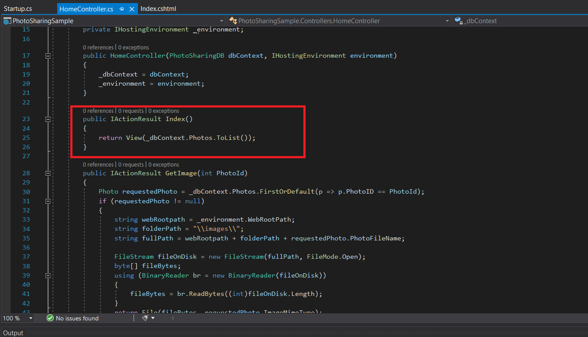

1. **Nombres y apellidos:** Carola Casais Recondo
2. **Fecha:** Martes 24 de noviembre de 2020
3. **Resumen del Ejercicio:** El objetivo de este ejercicio es iniciarnos en ASP.NET Core MVC. Para ello localizamos los siguientes fragmentos de código:

4. **Dificultad o problemas presentados y como se resolvieron:** No hubo dificultades en este ejercicio.
